# Capstone Project: E-Commerce Application CI/CD Pipeline

## Project Overview: Automated Pipeline for an E-Commerce Platform

## Hypothetical Use Case:

### You’re tasked with developing and maintaining an e-commerce platform. This platform has two primary components:

- E-Commerce API (backend service handling product listings, user accounts, and order processing).

- E-Commerce Frontend: A web application for users to browse products, manage their accounts, and place orders.

### The goal is to automate the integration and deployment process for both components using GitHub Actions, ensuring continuous delivery and integration.

# Project Tasks:

## Task 1: Project Setup

- Create a new GitHub repository named ecommerce-pipeline.

- Inside the repository, create two directories: api for the backend and webapp for the frontend.

## Task 2: Initialize GitHub Actions

- Initialize a Git repository and add your initial project structure.

- Create a .github/workflows/ directory in your repository for GitHub Actions.

## Task 3: Backend API Setup

- In the api/ directory, set up a simple Node.js/Express application that handles basic e-commerce operations.

- Implement unit tests for your API.

## Task 4: Frontend Web Application Setup

- In the webapp/ directory, create a simple React application that interacts with the backend API.

- Ensure the frontend has basic features like product listing, user login, and order placement.

## Task 5: Continuous Integration Workflow

- Write a GitHub Actions workflow for the backend and frontend that:

- Installs dependencies.

- Runs tests.

- Builds the application.

## Task 6: Docker Integration

- Create Dockerfiles for both the backend and frontend.

- Modify your GitHub Actions workflows to build Docker images.

## Task 7: Deploy to Cloud

- Choose a cloud platform for deployment (AWS, Azure, or GCP).

- Configure GitHub Actions to deploy the Docker images to the chosen cloud platform.

- Use GitHub Secrets to securely store and access cloud credentials.

## Task 8: Continuous Deployment

- Configure your workflows to deploy updates automatically to the cloud environment when changes are pushed to the main branch.

## Task 9: Performance and Security

- Implement caching in your workflows to optimize build times.

- Ensure all sensitive data, including API keys and cloud credentials, are secured using GitHub Secrets.

## Task 10: Project Documentation


# E-Commerce Platform CI/CD Pipeline

This project automates CI/CD for a Node.js + React e-commerce platform.

## Structure
- `api/`: Backend Express API
- `webapp/`: Frontend React app
- `.github/workflows/ci.yml`: GitHub Actions pipeline for CI/CD
- `deployment/`: EC2 setup and SSH key placeholders

## 🚀 EC2 Deployment Instructions

### 1. Prepare EC2 Instance
- Launch Ubuntu EC2.
- Open ports 22, 3000, 3001 in the security group.
- SSH into the instance and run the script:

```bash
chmod +x deployment/setup-ec2.sh
./deployment/setup-ec2.sh
```

### 2. Generate SSH Key
```bash
ssh-keygen -t rsa -b 4096 -f ecommerce-ec2-key
```

Add the public key to EC2:  
```bash
ssh-copy-id -i ecommerce-ec2-key.pub ubuntu@<EC2_PUBLIC_IP>
```

### 3. GitHub Secrets
Set these in GitHub:
- `EC2_HOST`: Your EC2 public IP
- `EC2_SSH_KEY`: Paste content of private key
- `DOCKER_USERNAME` and `DOCKER_PASSWORD`: For DockerHub

### 4. Push Code
Push this project to GitHub. GitHub Actions will:
- Build and test
- Build and push Docker images
- SSH to EC2 and deploy backend/frontend

Visit:
- Backend: http://<EC2_IP>:3000/products
- Frontend: http://<EC2_IP>:3001


# Project Implementataion

## Step 1:

### Creating project repository

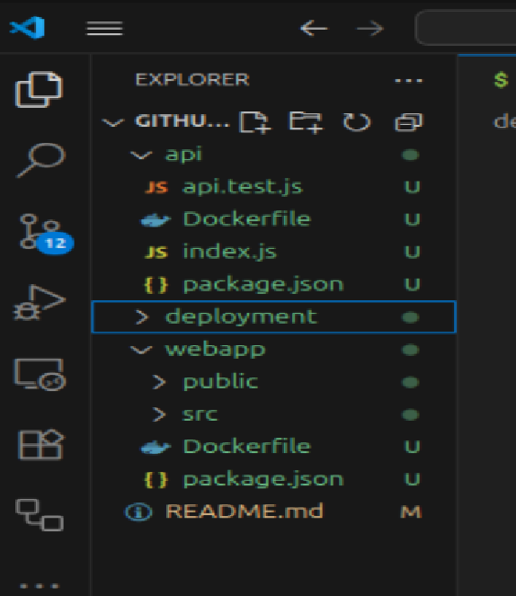

### Step 2:

### Creating project repository on github

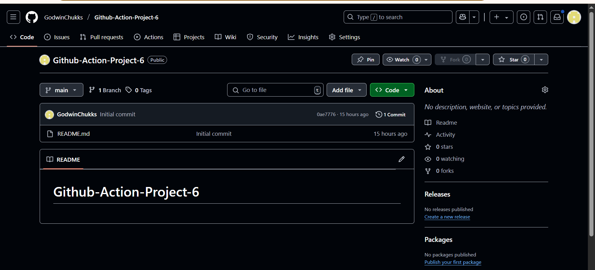

### Creating project github repository,  initializing and adding project structure

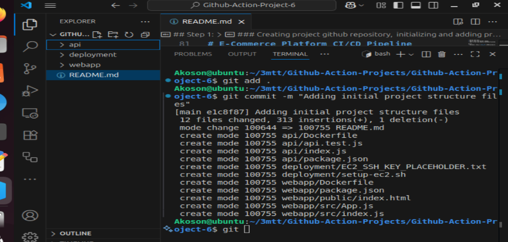

### Pushing project file structure to github repository.

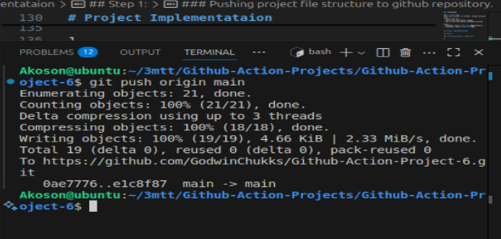

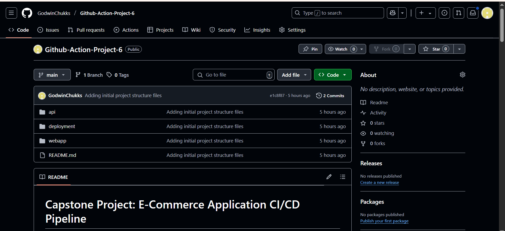

### Setting up AWS EC2 instance for app deployment

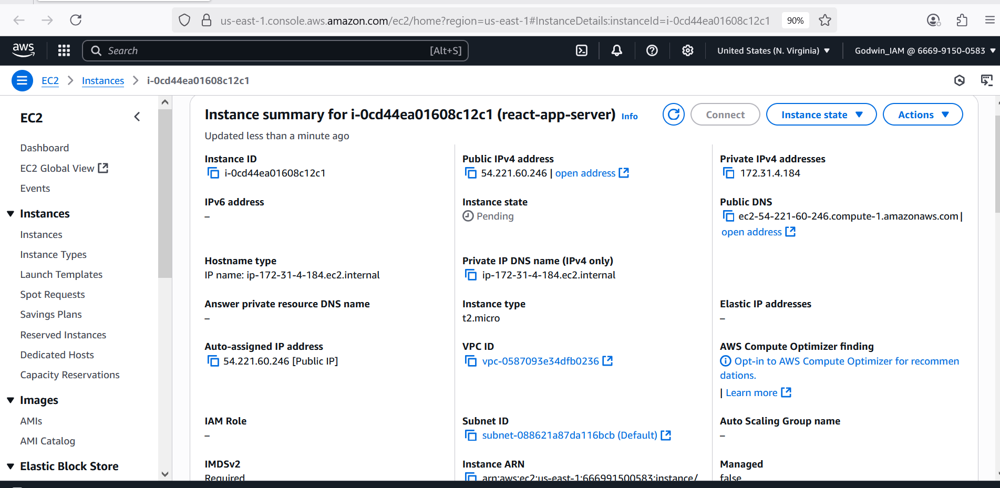

### EC2 instance security setup

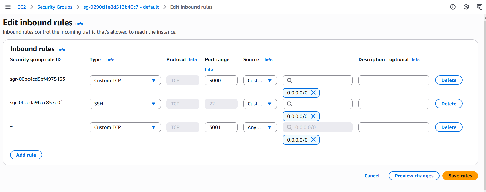

### Setting up secrets

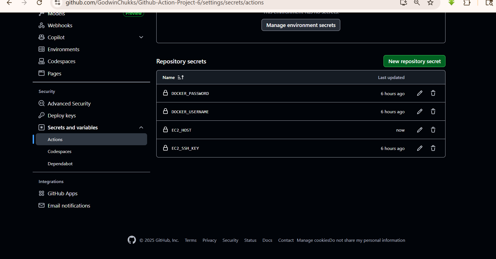

### Connecting to ec2 instance via shh

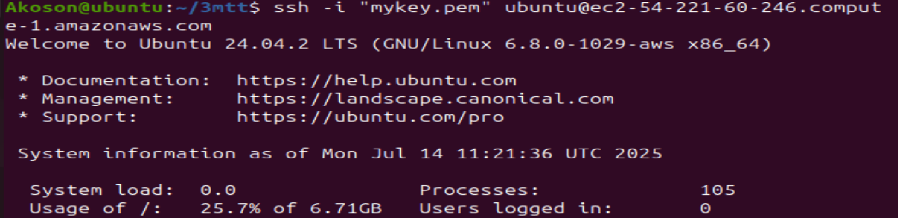
### installing docker on ec2

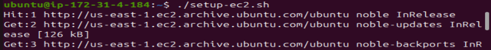

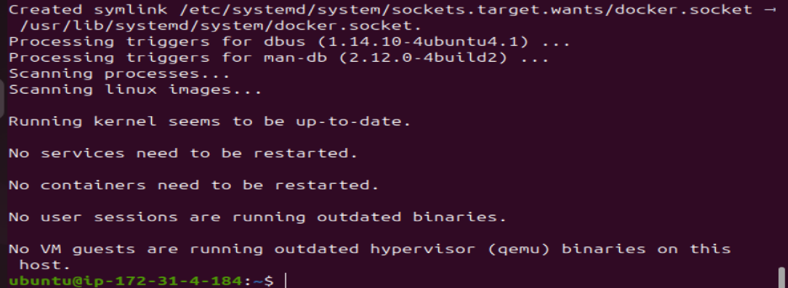

### Push project to github repository to initiate our pipeline

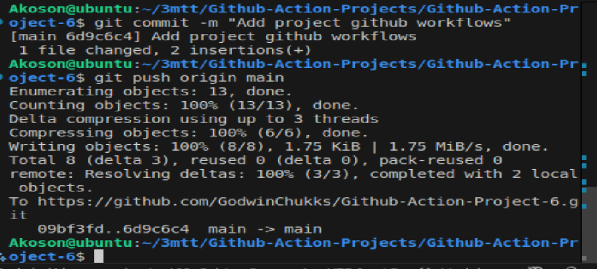

### Github Action successfully build, test, and deploy to dockerhub image registry and AWS Ec2 instance

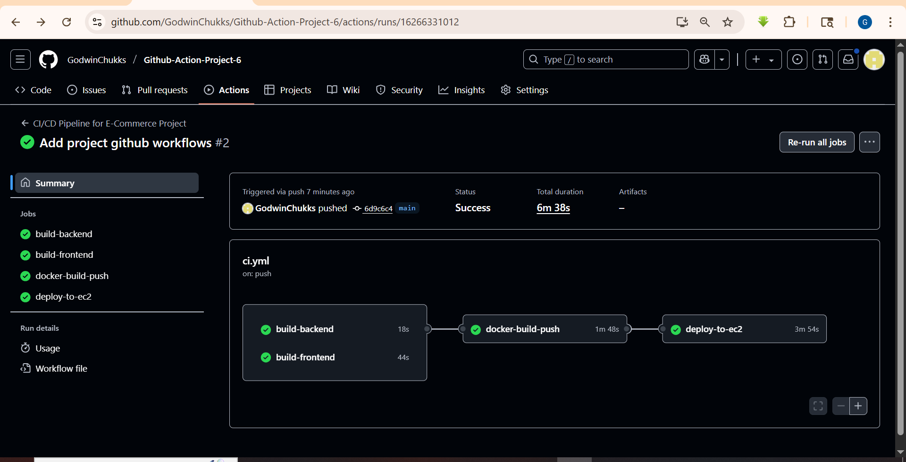

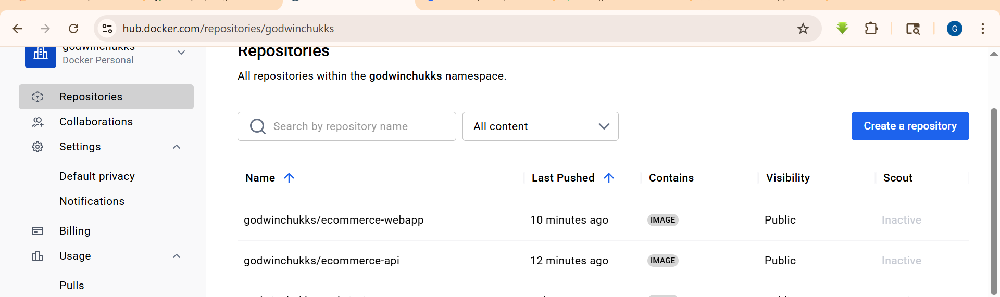

### Accessing our web applicant front and backend

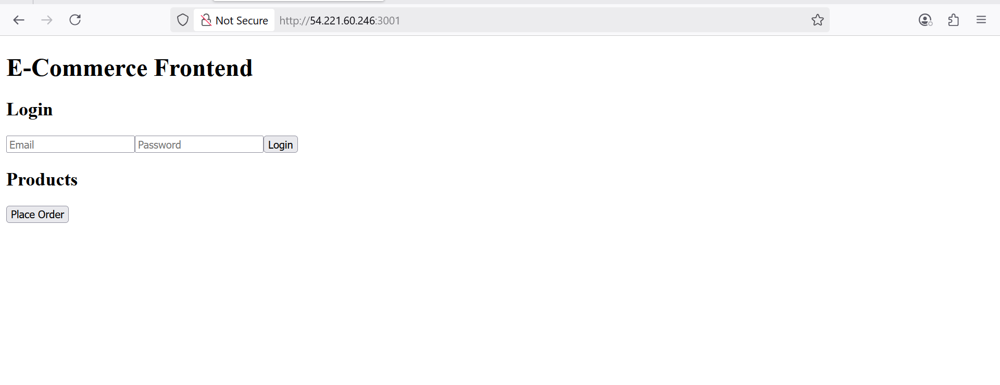

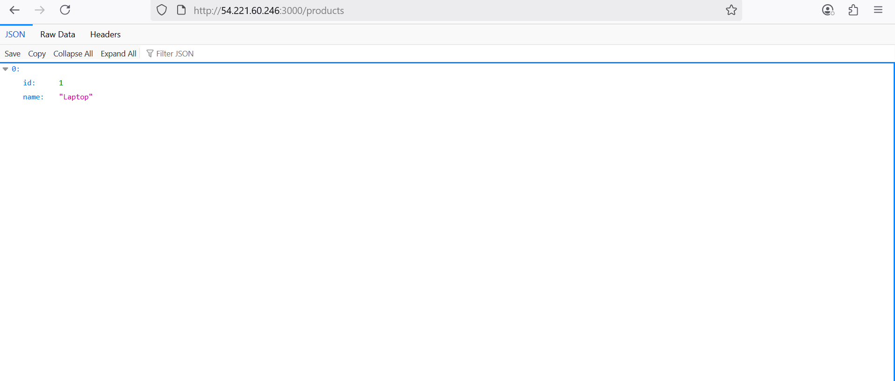

### Entire project structure

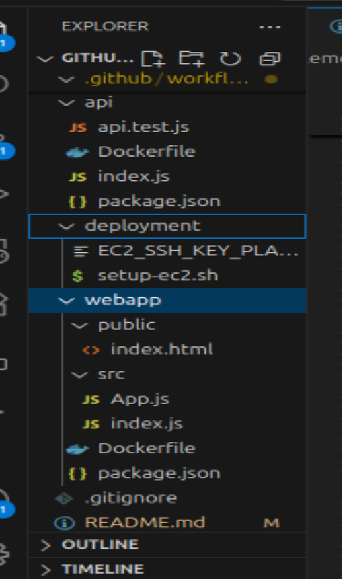


## Step-by-Step Checklist to Fix "Can't Access App on EC2"

- Are the ports open in the EC2 Security Group?

- Are the Docker containers actually running?

### 1. SSH into your EC2 instance:
`ssh -i mykey.pem ubuntu@<EC2_PUBLIC_IP>`

### 2. Then run the command:
`docker`

### You should see something like:

```
CONTAINER ID   IMAGE               PORTS                    NAMES
abc123...      ecommerce-api       0.0.0.0:3000->3000/tcp   ecommerce-api
def456...      ecommerce-webapp    0.0.0.0:3001->3000/tcp   ecommerce-webapp

```

### 3. If they're not running, check logs:
`docker logs ecommerce-api`
`docker logs ecommerce-webapp`

### 4. Try accessing via curl or browser
`curl http://<EC2_PUBLIC_IP>:3000/products`

### 5. Try accessing from EC2 itself

`curl localhost:3000/products`

### If this works, but your browser fails, it’s definitely a Security Group issue.

### Visit:
- Backend: http://<EC2_IP>:3000/products
- Frontend: http://<EC2_IP>:3001


## How to push to Github Repo but not Trigger Github Action


## Option 1:

### Push to a Different Branch
`git checkout -b staging`
`git push origin staging`

## Option 2: 

### Temporarily Disable the Workflow File
### Rename the workflow file so GitHub ignores it:

```
mv .github/workflows/ci.yml .github/workflows/ci.yml.disabled
git add .github/workflows/ci.yml.disabled
git commit -m "Temporarily disable CI"
git push origin main

```

### Re-enable later:

```
mv .github/workflows/ci.yml.disabled .github/workflows/ci.yml
git add .github/workflows/ci.yml
git commit -m "Re-enable CI"
git push origin main

```

## Option 3:

### Use [skip ci] in Commit Message Just add [skip ci] (or [ci skip]) in your commit message:

`git commit -m "Update docs [skip ci]"`
`git push origin main`
### GitHub will not run any workflows for that commit.

## Option 4: 

### Disable Workflow from GitHub Settings
- Go to your GitHub repo

- Click Actions

- Click the workflow name (e.g., CI/CD Pipeline for E-Commerce Project)

- Click Disable workflow

### You can enable it again later.


